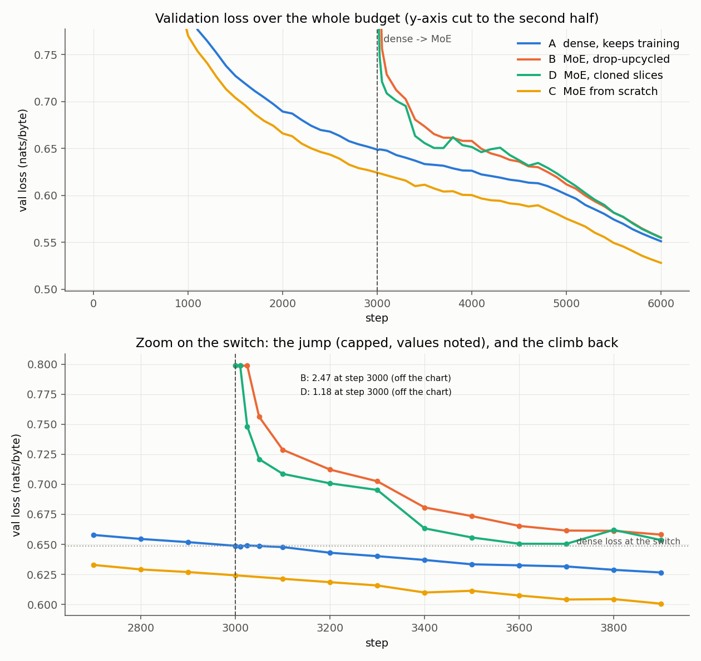
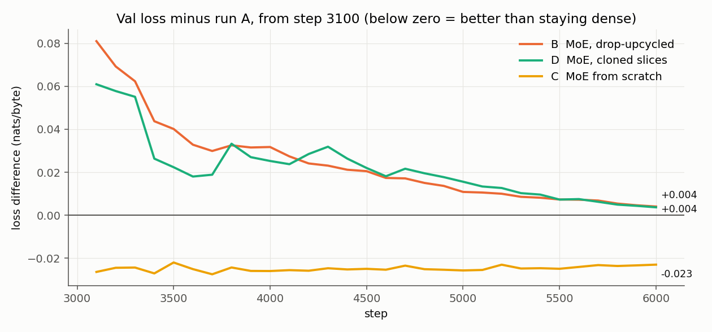
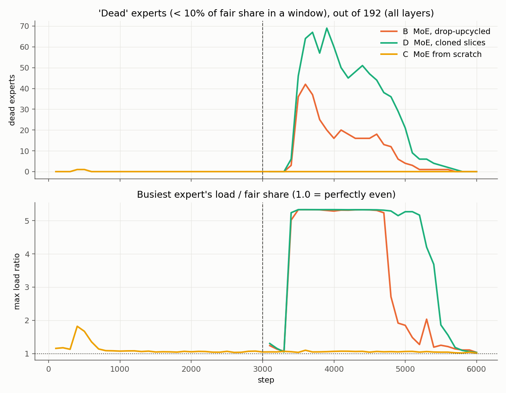
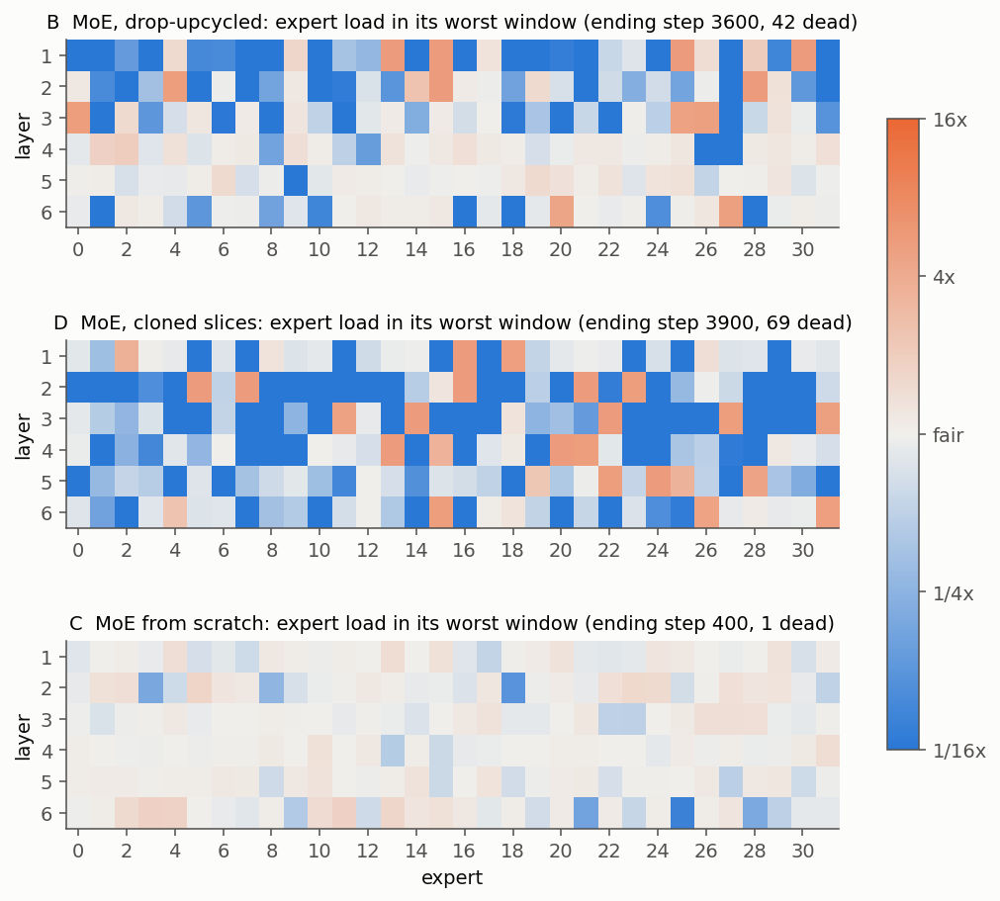
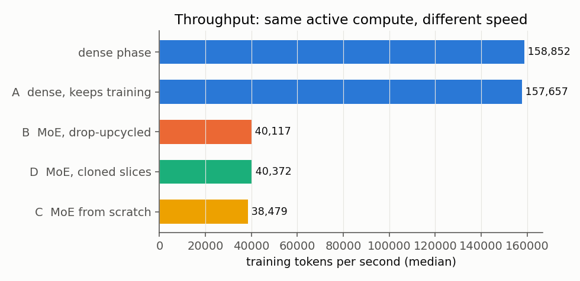
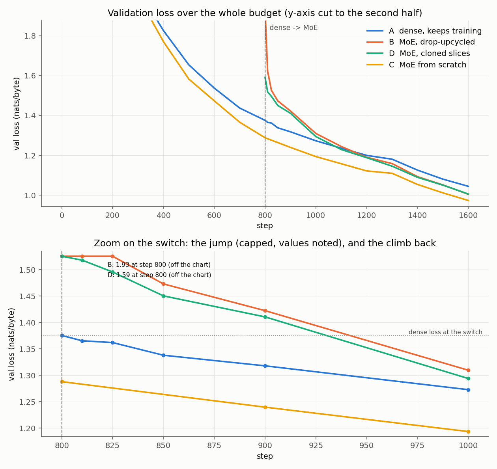
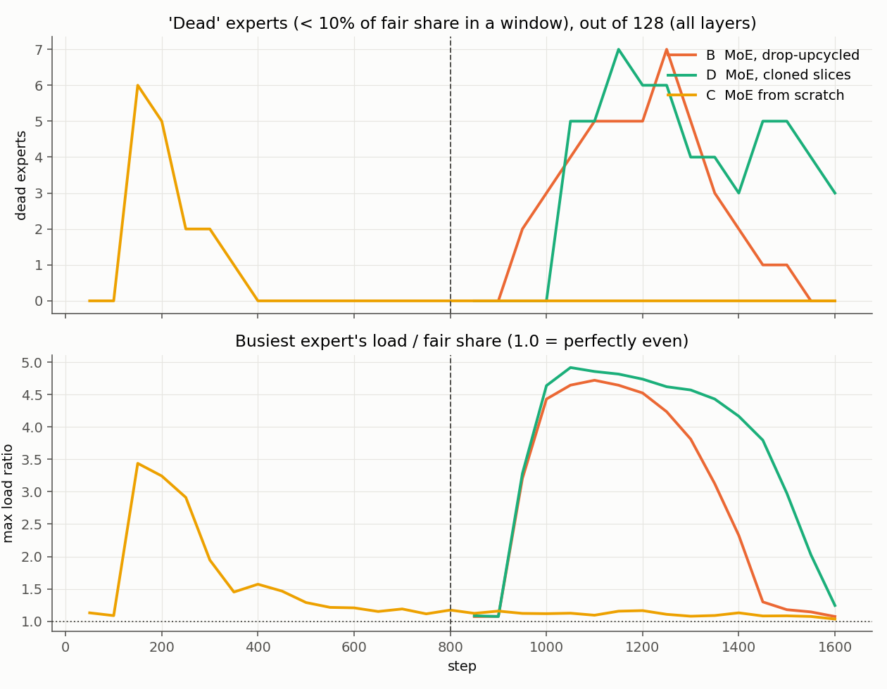

# Session 14 — Train a dense model, turn it into a Mixture of Experts, keep training

**Assignment:** train a "linear" model, convert it into an MoE (model size and data are my call), and
show that it keeps training and its loss keeps dropping.

**What I built:** a ~10.8M-parameter GPT trained on TinyStories, converted at the halfway point into
an MoE with 1 shared expert + 32 routed experts (the router picks 6 per token), then trained further.
Next to it I ran three comparison runs. Without them, "the loss went down after the conversion"
would prove nothing — any model that keeps training keeps lowering its loss.

> **A note on the word "linear".** In the session, Rohan uses "linear model" for a normal transformer
> whose feed-forward block is one big network ("the 2B linear model became a 5B linear model").
> It does not mean a model without non-linearities. I call it the **dense** model below.

---

## 1. Results on the T4 (the submitted run)

| run | total params | active params / token | final val loss | vs A | jump at switch | steps to get back to the dense loss | dead experts (final / peak) | tokens/s |
|---|---:|---:|---:|---:|---:|---:|---:|---:|
| A — dense, keeps training | {{main:runs.A_dense_cont.params_total:,}} | {{main:runs.A_dense_cont.params_active:,}} | {{main:runs.A_dense_cont.final_val:.4f}} | — | — | — | — | {{main:runs.A_dense_cont.tok_per_sec:,.0f}} |
| **B — MoE, drop-upcycled** | {{main:runs.B_moe_drop.params_total:,}} | {{main:runs.B_moe_drop.params_active:,}} | **{{main:runs.B_moe_drop.final_val:.4f}}** | {{main:runs.B_moe_drop.final_gap_vs_A:+.4f}} | {{main:runs.B_moe_drop.jump:+.4f}} | {{main:runs.B_moe_drop.steps_to_recover}} | {{main:runs.B_moe_drop.load_final_window.dead}} / {{main:runs.B_moe_drop.dead_experts_peak}} | {{main:runs.B_moe_drop.tok_per_sec:,.0f}} |
| D — MoE, cloned slices | {{main:runs.D_moe_clone.params_total:,}} | {{main:runs.D_moe_clone.params_active:,}} | {{main:runs.D_moe_clone.final_val:.4f}} | {{main:runs.D_moe_clone.final_gap_vs_A:+.4f}} | {{main:runs.D_moe_clone.jump:+.4f}} | {{main:runs.D_moe_clone.steps_to_recover}} | {{main:runs.D_moe_clone.load_final_window.dead}} / {{main:runs.D_moe_clone.dead_experts_peak}} | {{main:runs.D_moe_clone.tok_per_sec:,.0f}} |
| C — MoE from scratch | {{main:runs.C_moe_scratch.params_total:,}} | {{main:runs.C_moe_scratch.params_active:,}} | {{main:runs.C_moe_scratch.final_val:.4f}} | {{main:runs.C_moe_scratch.final_gap_vs_A:+.4f}} | — | — | {{main:runs.C_moe_scratch.load_final_window.dead}} / {{main:runs.C_moe_scratch.dead_experts_peak}} | {{main:runs.C_moe_scratch.tok_per_sec:,.0f}} |

Dense validation loss at the switch (step {{main:switch_step}}): **{{main:dense_val_at_switch:.4f}}** nats/byte.
Dead expert = got less than 10% of its fair share of tokens in a 100-step window; counted over all
6 layers × 32 experts = 192 expert slots.

### Findings

**The short version.** The converted model kept training and kept lowering its loss — the assignment's
condition is met. But in the 3,000 steps after conversion it only *caught up* with the dense model; it
did not beat it ({{main:runs.B_moe_drop.final_gap_vs_A:+.4f}} nats/byte at the end, which is within
noise for a single run). The reason is not the MoE idea itself: the same MoE trained from scratch (C)
was ahead of the dense model at every evaluation from step 400 to the end. The reason is that **the router collapsed for about half of
the post-conversion budget**, right after the random-picking period ended. My CPU pilot (section 6)
showed the same collapse in a milder form; at full size it was much worse.

**1. It keeps training and keeps reducing loss.** Run B's validation loss at each 500-step check
after the switch:

| step | 3,000 (just converted) | 3,500 | 4,000 | 4,500 | 5,000 | 5,500 | 6,000 |
|---|---:|---:|---:|---:|---:|---:|---:|
| B val loss | {{main:runs.B_moe_drop.val_by_step.3000:.4f}} | {{main:runs.B_moe_drop.val_by_step.3500:.4f}} | {{main:runs.B_moe_drop.val_by_step.4000:.4f}} | {{main:runs.B_moe_drop.val_by_step.4500:.4f}} | {{main:runs.B_moe_drop.val_by_step.5000:.4f}} | {{main:runs.B_moe_drop.val_by_step.5500:.4f}} | {{main:runs.B_moe_drop.val_by_step.6000:.4f}} |
| B minus A | {{main:runs.B_moe_drop.gap_vs_A_by_step.3000:+.4f}} | {{main:runs.B_moe_drop.gap_vs_A_by_step.3500:+.4f}} | {{main:runs.B_moe_drop.gap_vs_A_by_step.4000:+.4f}} | {{main:runs.B_moe_drop.gap_vs_A_by_step.4500:+.4f}} | {{main:runs.B_moe_drop.gap_vs_A_by_step.5000:+.4f}} | {{main:runs.B_moe_drop.gap_vs_A_by_step.5500:+.4f}} | {{main:runs.B_moe_drop.gap_vs_A_by_step.6000:+.4f}} |

Every check is lower than the one before, and the gap to the dense model shrinks at every check. It
was back below the dense model's loss at the switch ({{main:dense_val_at_switch:.4f}}) after
{{main:runs.B_moe_drop.steps_to_recover}} steps.

**2. Converting costs a big loss jump, but most of it is gone in 10 steps.** Right after conversion B
was at {{main:runs.B_moe_drop.val_right_after_switch:.4f}} (a jump of {{main:runs.B_moe_drop.jump:+.4f}}),
because half of every routed expert's neurons are fresh random weights. Ten steps later it was at
{{main:runs.B_moe_drop.post_switch_curve.1.1:.4f}}, and {{main:runs.B_moe_drop.post_switch_curve.6.1:.4f}}
by step {{main:runs.B_moe_drop.post_switch_curve.6.0}}. Cloning (D) jumped less
({{main:runs.D_moe_clone.jump:+.4f}}) because nothing is redrawn.

**3. Why B did not pull ahead: the router collapsed.** For the first 300 steps the router picks experts
by random sampling; the busiest expert never got more than {{main:runs.B_moe_drop.max_ratio_during_explore:.2f}}×
its fair share. Within 100 steps of switching back to plain top-6, a few experts in several layers
were being picked by (almost) **every** token — {{main:runs.B_moe_drop.max_ratio_peak:.2f}}× their fair share,
which is the most possible ({{main:runs.B_moe_drop.max_ratio_possible:.2f}}× = 32 experts / 6 picks) —
and up to {{main:runs.B_moe_drop.dead_experts_peak}} of the 192 experts got almost nothing
({{main:runs.D_moe_clone.dead_experts_peak}} in D). This lasted from the window ending at step
{{main:runs.B_moe_drop.collapse_first_step}} to the one ending at {{main:runs.B_moe_drop.collapse_last_step}}
in B, and until {{main:runs.D_moe_clone.collapse_last_step}} in D. For that stretch, the MoE was
effectively a small model running the same few experts for every token, so the extra experts were
paying for nothing. Once balance came back, B's gap to the dense model kept closing.

Why the balancing bias was so slow [likely]: it moves 0.001 per step. At the end, B's biases spanned
{{main:runs.B_moe_drop.bias_final_min:.3f}} to {{main:runs.B_moe_drop.bias_final_max:.3f}} — a spread of
several hundred steps' worth of nudges. DeepSeek-V3 uses 0.001 over hundreds of thousands of steps, so a
few hundred steps of correction is nothing for them; for me the collapse covered close to half of
the post-conversion budget. (The
transcript said 0.01, which would have been ten times faster. I did not test it.)

**4. The MoE idea itself works when routing is healthy.** Run C — the same MoE trained from scratch —
was ahead of the dense model at every check from step 3,000 ({{main:runs.C_moe_scratch.gap_vs_A_by_step.3000:+.4f}})
to step 6,000 ({{main:runs.C_moe_scratch.final_gap_vs_A:+.4f}}), with the same active compute per
token. Its routing stayed healthy throughout: worst moment {{main:runs.C_moe_scratch.dead_experts_peak}}
dead expert, busiest expert {{main:runs.C_moe_scratch.max_ratio_peak:.2f}}× fair share. So the collapse
in B and D is a conversion problem, not an MoE problem.

**5. The cloned experts stayed near-copies (Rohan's V4 warning).** In D, the most alike pair of
experts started as exact copies (cosine similarity {{main:runs.D_moe_clone.expert_similarity_at_birth_max:.2f}})
and was still at {{main:runs.D_moe_clone.expert_similarity_final_max:.2f}} after 3,000 steps (layer
average), against {{main:runs.B_moe_drop.expert_similarity_final_max:.2f}} in B. D also had the worse
collapse: more dead experts, and it lasted longer. Same final loss as B, but less useful experts.

**6. At this size, dense wins on wall-clock time.** On the T4 an MoE step was
{{main:dense_speed_over_moe:.1f}}× slower than a dense step ({{main:runs.B_moe_drop.tok_per_sec:,.0f}}
vs {{main:runs.A_dense_cont.tok_per_sec:,.0f}} tokens/s), even though both do the same arithmetic per
token — the router, sorting tokens by expert and 32 small matrix multiplies cost more than one big one.
Run A reached {{main:runs.A_dense_cont.final_val:.4f}} in {{main:runs.A_dense_cont.gpu_seconds_total:,.0f}} s
of training steps (dense phase included, evaluation excluded); B reached {{main:runs.B_moe_drop.final_val:.4f}} in {{main:runs.B_moe_drop.gpu_seconds_total:,.0f}} s;
C needed {{main:scratch_gpu_seconds_to_match_B:,.0f}} s (step {{main:scratch_steps_to_match_B}}) to reach B's
final loss. Per step, the MoE (C) wins; per second, the dense model wins.

**What I would change next time:** fade the random picking out gradually instead of switching it off;
use a faster bias step (e.g. 0.01) for the first ~1,000 steps after conversion; and give the converted
model a longer budget after the switch.







---

## 2. Setup

| | |
|---|---|
| Data | TinyStories V2 (GPT-4 stories). Train = first 200 MB of the train file (about 2× what the longest run reads, so no text is seen twice). Validation = the separate 22 MB validation file. |
| Tokens | Raw bytes (vocabulary 256). No tokenizer download, and almost every weight sits in the transformer blocks — which is exactly where the conversion happens. Loss is in **nats per byte**. |
| Dense model | 6 layers, 6 heads, width 384, context 256. Feed-forward block 384 → 1,536 → 384. **10.8M parameters.** |
| MoE model | Same, but each feed-forward block = 1 shared expert (384 neurons, always on) + 32 routed experts (192 neurons each), top-6. Active feed-forward neurons per token: 384 + 6 × 192 = **1,536 — the same as dense**. Total: 384 + 32 × 192 = 6,528 — **4.25× dense**. **33.9M total parameters, 10.9M active** (the extra 0.07M is the routers). |
| Training | Batch 64 × 256 = 16,384 bytes per step. 6,000 steps in total for every run, switch at 3,000. AdamW (0.9, 0.95), weight decay 0.1, clip 1.0, peak LR 1e-3. Warmup–stable–decay schedule on one global step clock (200 warmup, decay over the last 20%), so every run gets the same LR at the same step. fp16 autocast + loss scaling on the T4. |
| Same data | The batch for step *s* comes from a random generator seeded with *(seed, s)*. Every run sees **identical bytes at the same step**, so differences between runs come from the model, not the data. |

The key design choice: **active compute per token is the same in dense and MoE.** So when the MoE
wins, it wins because it owns more weights, not because it does more arithmetic per token.

---

## 3. How the conversion works (plain English)

**A feed-forward block is just a sum of neurons.** Neuron *j* has an input row (what it reads from
the token) and an output column (what it writes back). The block's output is the sum of all 1,536
neurons' contributions. So if I split the neurons into groups and add the groups back together, I
get the dense output exactly. Everything below builds on this.

**Shared expert.** I pick 384 of the 1,536 dense neurons at random and copy them, untouched, into
the shared expert. It is always on — the "manager" Rohan described.

**Routed experts — two ways (both from the session):**

* **Cloned slices (run D).** The other 1,152 neurons are cut into 6 slices of 192. The 32 experts
  are copies of those 6 slices (5–6 copies each). Nothing is redrawn. This is the case Rohan said
  failed in V4: identical clones that the router cannot tell apart.
* **Drop-upcycling (run B, main).** Each expert takes a random 192 of the 1,152 neurons, then
  **half of them are redrawn** with fresh random values (same mean and spread as the weights they
  replace). Experts start out different from each other. Ratio 0.5 is the value the
  Drop-Upcycling paper found best, and the one Rohan said V4 used.

**Everything else** (attention, embeddings, norms) is copied 1:1, and keeps its Adam optimizer
memory. The new tensors (experts, router) start with fresh Adam memory.

**The router**, per token, per layer:

1. multiplies the token by a small 384 × 32 matrix → 32 numbers, computed in **fp32** (Rohan:
   a router in 16-bit did not survive in Switch Transformer)
2. turns them into scores with a **sigmoid** (the DeepSeek-V3 choice)
3. picks 6 experts — the 6 highest *(score + balance bias)*
4. weights the 6 picked experts by their scores, rescaled to sum to 6 (so each expert gets ≈ 1 on
   average, the same as when it was part of the dense block)
5. output = shared expert + weighted sum of the 6 picked experts. **No token is ever dropped.**

**Balancing without an extra loss (DeepSeek-V3).** Each expert has a bias that only changes *who
is picked*, never the weights. After every step: an expert busier than average gets its bias
lowered by 0.001, a less busy one gets it raised by 0.001. Nothing is added to the loss.

**Probabilistic top-k for the first 300 steps after conversion.** Instead of always taking the top 6,
the router *samples* 6 experts with probability proportional to their scores. A low-scoring expert
still gets picked now and then, so it still gets trained before the router settles. This is the fix
Rohan described for V4's dead clones.

---

## 4. The four runs and what each one answers

| run | steps | question it answers |
|---|---|---|
| dense phase | 0 → 3,000 | shared starting point for A, B and D |
| **A** dense keeps training | 3,000 → 6,000 | the control. Is converting better than *not* converting? |
| **B** drop-upcycled MoE | 3,000 → 6,000 | the assignment: does the converted model keep training and keep reducing loss? |
| **D** cloned-slice MoE | 3,000 → 6,000 | does the "smooth" clone conversion leave experts that never become different? |
| **C** MoE from scratch | 0 → 6,000 | does starting from the dense model save anything, compared with just training the MoE from step 0? |

What I measure: validation loss just before and just after the switch (the **jump**), how many
steps to get back to the dense loss, final validation loss, expert load per window (dead experts,
busiest expert vs fair share), how alike the experts are, and tokens per second.

---

## 5. What I checked before trusting any number

`python -m tests.test_all` — 20 checks, all pass. The important ones:

* **Partition identity.** Build the MoE with the 6 disjoint slices as experts, make the router pick
  all 6 with weight 1: the MoE output equals the dense output (max difference ~1e-6). This proves
  the neurons landed in the right rows and columns — a mix-up would give a large mismatch.
* **Full-copy identity.** Every expert a complete copy of the dense block + softmax gates
  renormalised to sum to 1: output equals dense **whatever the router says**. This is the only
  conversion with *zero* jump. It needs experts as wide as the whole dense block, so it is a test,
  not one of my runs (see section 7).
* Drop-upcycling keeps exactly half of each expert's neurons as real dense neurons; the shared
  expert is an exact copy; attention/embeddings are copied exactly.
* Every token gets exactly 6 *different* experts, in both normal and sampling mode.
* The balance bias changes who is picked but not the gate weights; a busy expert's bias goes down.
* Adam memory is carried for every non-feed-forward tensor and nothing else.
* Same step → same batch in every run.
* The router receives gradient through the gate weights.

`python fill_readme.py --check` — every number in this README is a placeholder filled from
`results/summary.json` / `pilot/results/summary.json`, which are themselves re-computed from the
per-run logs on disk. No number is typed by hand.

---

## 6. CPU pilot on real TinyStories (run before the GPU run, to de-risk the design)

Same design, scaled down to fit a 2-core CPU: 4 layers, width 128, dense feed-forward 512; MoE = 1
shared expert (128) + 32 routed experts (64 each), top-6 → active feed-forward 512, same as dense.
Context 128, batch 32, 1,600 steps, switch at 800. Exploration window 100 steps.

| run | total params | active | final val loss | vs A | jump at switch | steps back to dense loss | dead experts (final / peak) |
|---|---:|---:|---:|---:|---:|---:|---:|
| A — dense, keeps training | {{pilot:runs.A_dense_cont.params_total:,}} | {{pilot:runs.A_dense_cont.params_active:,}} | {{pilot:runs.A_dense_cont.final_val:.4f}} | — | — | — | — |
| B — MoE, drop-upcycled | {{pilot:runs.B_moe_drop.params_total:,}} | {{pilot:runs.B_moe_drop.params_active:,}} | {{pilot:runs.B_moe_drop.final_val:.4f}} | {{pilot:runs.B_moe_drop.final_gap_vs_A:+.4f}} | {{pilot:runs.B_moe_drop.jump:+.4f}} | ≤ {{pilot:runs.B_moe_drop.steps_to_recover}} | {{pilot:runs.B_moe_drop.load_final_window.dead}} / {{pilot:runs.B_moe_drop.dead_experts_peak}} |
| D — MoE, cloned slices | {{pilot:runs.D_moe_clone.params_total:,}} | {{pilot:runs.D_moe_clone.params_active:,}} | {{pilot:runs.D_moe_clone.final_val:.4f}} | {{pilot:runs.D_moe_clone.final_gap_vs_A:+.4f}} | {{pilot:runs.D_moe_clone.jump:+.4f}} | ≤ {{pilot:runs.D_moe_clone.steps_to_recover}} | {{pilot:runs.D_moe_clone.load_final_window.dead}} / {{pilot:runs.D_moe_clone.dead_experts_peak}} |
| C — MoE from scratch | {{pilot:runs.C_moe_scratch.params_total:,}} | {{pilot:runs.C_moe_scratch.params_active:,}} | {{pilot:runs.C_moe_scratch.final_val:.4f}} | {{pilot:runs.C_moe_scratch.final_gap_vs_A:+.4f}} | — | — | {{pilot:runs.C_moe_scratch.load_final_window.dead}} / {{pilot:runs.C_moe_scratch.dead_experts_peak}} |

("≤" because evaluations after the switch are at +10, +25, +50, +100, +200 steps; the loss was back
below the dense value somewhere between +100 and +200.)

**What the pilot showed:**

1. **The converted model keeps training and keeps reducing loss — and (in the pilot only) ends up
   better than not converting.** This did not hold at full size within the budget (section 1). B's final loss minus the dense control A's: **{{pilot:runs.B_moe_drop.final_gap_vs_A:+.4f}}**
   nats/byte (negative = better), with the same active compute per token. It crossed below A around step 1,200.
2. **Conversion costs a loss jump first.** Dense loss at the switch was
   {{pilot:dense_val_at_switch:.4f}}; right after drop-upcycling it was
   {{pilot:runs.B_moe_drop.val_right_after_switch:.4f}} (**{{pilot:runs.B_moe_drop.jump:+.4f}}**). Half of
   every routed expert's neurons are brand-new random weights, so the model has to re-learn that part.
   Cloning (D) jumped less ({{pilot:runs.D_moe_clone.jump:+.4f}}) because nothing is redrawn — it only
   loses whichever slices a token's 6 picks happen to miss (a token can pick two clones of the same
   slice and none of another). Both were back below the dense loss within 200 steps.
3. **The clones never fully separated.** In D, the most alike pair of experts started at cosine
   similarity {{pilot:runs.D_moe_clone.expert_similarity_at_birth_max:.2f}} (exact copies) and was still
   {{pilot:runs.D_moe_clone.expert_similarity_final_max:.2f}} at the end (layer average), against
   {{pilot:runs.B_moe_drop.expert_similarity_final_max:.2f}} for B. D also ended with
   {{pilot:runs.D_moe_clone.load_final_window.dead}} dead experts; B ended with
   {{pilot:runs.B_moe_drop.load_final_window.dead}}. Same final loss at this size, but D is carrying
   near-duplicate experts — the V4 failure mode, in a mild form.
4. **The surprise: the load imbalance appeared right after sampling switched off.** During the
   100-step sampling window, the busiest expert never got more than
   {{pilot:runs.B_moe_drop.max_ratio_during_explore:.2f}}× its fair share. Once the router went back to
   plain top-6 (step {{pilot:runs.B_moe_drop.explore_end_step}}), the busiest expert climbed to
   {{pilot:runs.B_moe_drop.max_ratio_peak:.1f}}× (step {{pilot:runs.B_moe_drop.max_ratio_peak_step}}) and up
   to {{pilot:runs.B_moe_drop.dead_experts_peak}} experts went dead. The balancing bias pulled it back,
   but slowly: a bias step of 0.001 per training step needs a few hundred steps to move the scores
   enough. The scratch run C showed the same pattern after *its* sampling window
   ({{pilot:runs.C_moe_scratch.max_ratio_peak:.1f}}× at step {{pilot:runs.C_moe_scratch.max_ratio_peak_step}}).
   My reading [likely, one run]: sampling *hides* the router's preferences rather than fixing them. Two fixes I would try next:
   fade the sampling out gradually instead of switching it off, or use a larger bias step during the
   first few hundred steps after conversion.
5. **Upcycling did not beat the scratch MoE per step — but it did per second of compute.** C,
   trained as an MoE from step 0, finished at {{pilot:runs.C_moe_scratch.final_val:.4f}}, better than B
   ({{pilot:runs.B_moe_drop.final_val:.4f}}). But the dense half of B's run is about 3× faster per step
   than an MoE step on this hardware. C needed {{pilot:scratch_steps_to_match_B}} steps
   ({{pilot:scratch_gpu_seconds_to_match_B:,.0f}} s) to reach B's final loss; B's whole run took
   {{pilot:runs.B_moe_drop.gpu_seconds_total:,.0f}} s. So the answer to "does upcycling save compute?"
   depends on whether you count steps or seconds. (CPU timings, 2 cores, with some background load —
   treat the seconds as rough.)




---

## 7. Honest notes and where I departed from the lecture

* **Bias update speed.** The transcript says DeepSeek-V3 used γ = 0.01. The DeepSeek-V3 report
  (section 4.2) says **0.001** for the first 14.3T tokens and 0 for the last 500B. I used 0.001.
  The transcript is auto-generated, so this may be a transcription slip.
* **Zero-jump conversion is not one of my runs.** In my proposal I said copying with softmax weights
  gives no jump. That is true only when *every* expert is a full copy of the whole dense block
  (checked in the tests). With fine-grained experts (192 of the 1,536 neurons each) and top-6, no
  conversion can be exactly function-preserving, because each token only runs 6 of the slices.
  I kept one architecture for B, C and D so that their comparisons are fair, and measured the jump
  instead.
* **One growth stage, not several.** Rohan's V4 went dense → 20 experts → 460 experts. I do one
  step, dense → 32 experts.
* **No expert parallelism.** Everything is on one GPU, so the GPU-to-GPU traffic that dominates real
  MoE training does not appear here.
* **The MoE is slower per step at this size, not faster** ({{main:dense_speed_over_moe:.1f}}× on the T4).
  My MoE layer loops over the 32 experts in plain PyTorch; a fused kernel would close part of the gap.
  The compute savings Rohan described only show up at scale (thousands of neurons per expert, many GPUs).
* **I designed the collapse in.** Switching random picking off in one step, with a slow bias, is my
  choice, not something from the lecture. The pilot warned me (section 6, point 4), but I kept the agreed
  settings for the T4 run instead of changing the design between the pilot and the real run.
* **Single seed, short runs.** Differences smaller than ~0.01 nats/byte should not be read as real —
  that includes the B-vs-A and D-vs-A final gaps.

---

## 8. Reproduce

```bash
pip install -r requirements.txt
python -m tests.test_all          # 20 checks, CPU, ~10 s
python run_all.py --smoke         # whole pipeline on synthetic text, CPU, ~20 s (plumbing check only)
python run_all.py --pilot         # section 6: real TinyStories, scaled down, CPU, ~35 min
python run_all.py                 # section 1: the real run, needs a GPU (about 2 hours on a T4)
python fill_readme.py             # rebuild this README from results/ and pilot/results/
python fill_readme.py --check     # verify every number in the README against the files on disk
```

On Colab: open `session14_dense_to_moe.ipynb`, switch the runtime to T4, run the cells one at a
time. Finished runs print `LOADED FROM CACHE` and are not re-trained; interrupted runs print
`RESUMING`.

## 9. Repo layout

```
README.md                      this file (generated from README.template.md)
session14_dense_to_moe.ipynb   Colab notebook (generated by build_notebook.py)
run_all.py                     command-line entry point (same functions as the notebook)
src/config.py                  every setting, with the dense/MoE sizes explained
src/data.py                    TinyStories download, bytes, same-batch-per-step loader
src/model.py                   GPT with a dense or MoE feed-forward block; router; balancing bias
src/upcycle.py                 dense -> MoE: drop-upcycling, cloned slices, full copy (test only)
src/train.py                   training loop, WSD schedule, optimizer-state carry-over, checkpoints
src/experiments.py             the dense phase and runs A, B, C, D, with cache/resume
src/analysis.py                summary.json and the five figures, re-read from disk
tests/test_all.py              the 20 checks
results/, figures/             the T4 run
pilot/results/, pilot/figures/ the CPU pilot
```

## 10. References

* Rohan Shravan, ERA V5 Session 14 (2026-09-26) — MoE architecture, routers, balancing, growing an MoE.
* Nakamura et al., *Drop-Upcycling: Training Sparse Mixture of Experts with Partial Re-initialization*,
  ICLR 2025. arXiv:2502.19261.
* DeepSeek-AI, *DeepSeek-V3 Technical Report*, 2024. arXiv:2412.19437 — sigmoid router, bias used
  for selection only (section 2.1.2), γ = 0.001 (section 4.2).
* Komatsuzaki et al., *Sparse Upcycling: Training Mixture-of-Experts from Dense Checkpoints*, ICLR 2023.
  arXiv:2212.05055.
* Eldan & Li, *TinyStories*, 2023. arXiv:2305.07759.
